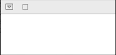
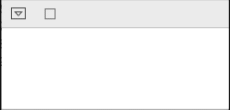

# What's the difference between `debounce` and `throttle`?

These operators also exist in other reactive implementations, such as RxSwift, yet they continue to elicit confusion as to what each one does and how they differ.

## Setup

The examples will use the following setup code:

```swift
// 1
let values = "abcdefghijklmnopqrstuvwxyz"
    .map { String(describing: $0) }
    .reduce([String]()) { values, next in
        let new = (values.last ?? "") + next
        return values + [new]
}

// 2
let subject = PassthroughSubject<(Double, String), Never>()

// 3
values.enumerated().forEach { i, value in
    let delay = TimeInterval(i) / 10.0
    
    DispatchQueue.main.asyncAfter(deadline: .now() + delay) {
        subject.send((delay, value))
    }
}
```
1. Create an array of incremental values `["a", "ab", "abc"...]`.
1. Create a passthrough subject to send values at specified time intervals.
1. Iterate over the array, sending each value to the passthrough subject after an increasing delay.

This code results in each value being sent at a rate of one character every tenth of a second.

## `debounce`

Essentially, `debounce` will **pause** for a specified time **after each value is received**, and then at the end of that pause it will **send the last value** through.

The following code creates a subscription to the `subject` created in the setup code:

```swift
let debounceSubscription = subject
    .debounce(for: .milliseconds(500), scheduler: DispatchQueue.main)
    .sink(receiveValue: { print($0.1) })
```

This code will produce the following output:



Each sequential value triggers a half-second pause, during which time nothing is sent. After the last value is sent (`a...z`), the half-second pause completes and that last value is sent and printed.

## `throttle`

Conversely, `throttle` **does not pause** after receiving values. Instead, it **waits for the specified interval** repeatedly, and at the end of each interval it will **send either the first or the last value** depending on what is passed for its `latest` parameter. 

When `true` is passed for `latest`, at the end of each interval it will send the _last_ value received during the time interval.

The following code creates a subscription to the `subject` created in the setup code:

```swift
let throttleLatestSubscription = subject
    .throttle(for: .milliseconds(500), scheduler: DispatchQueue.main, latest: true)
    .sink(receiveValue: { print($0.1) })
```

This code will produce the following output:



After each half-second interval, `throttle` sends the latest value it received during that interval.

If `latest` is `false`, `throttle` will send the _first_ value received during that time interval.

The following code creates a subscription to the `subject` created in the setup code:

```swift
let throttleFirstSubscription = subject
    .throttle(for: .milliseconds(500), scheduler: DispatchQueue.main, latest: false)
    .sink(receiveValue: { print($0.1) })
```

This code will produce the following output:


After each half-second interval, `throttle` sends the first value it received during that interval.

## Where can I learn more?

Check out this book that I am a co-author and the technical editor for:

[Combine: Asynchronous Programming with Swift](https://store.raywenderlich.com/a/742/link/27)

<a href="https://store.raywenderlich.com/a/742/link/27" alt="Combine: Asynchronous Programming with Swift"></a>

It's packed with coverage of Combine concepts, hands-on exercises in playgrounds, and complete iOS app projects. Everything you need to _transform yourself_ from novice to expert with Combine — and have fun while doing it!

[HackingCombine - Table of Contents](https://github.com/learncombine/HackingCombine)

Combine and SwiftUI are Copyright © 2019 Apple Inc.
